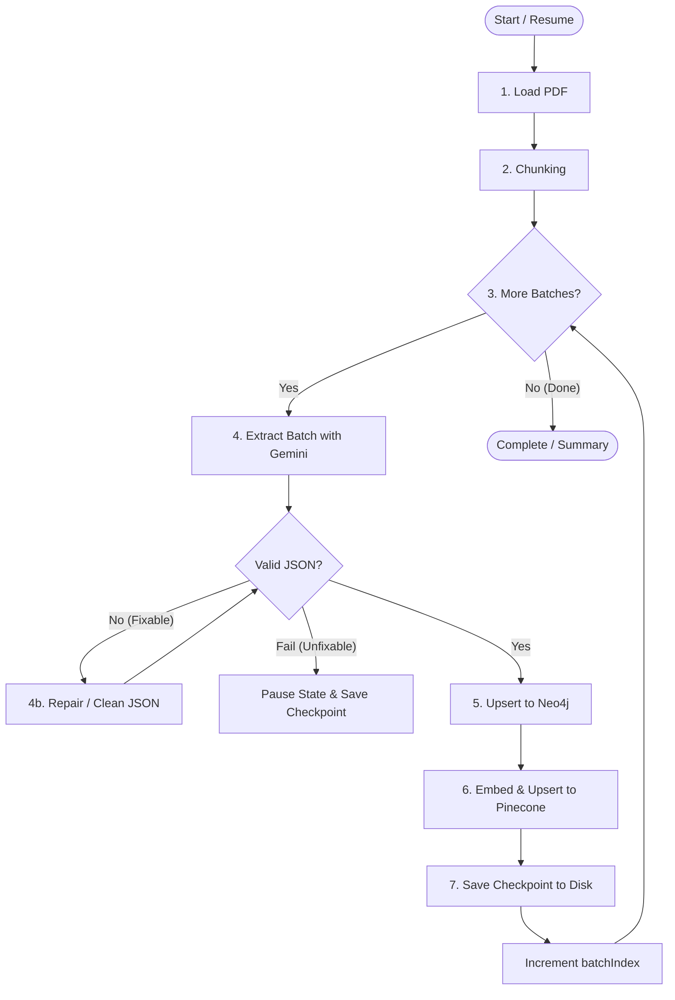

# LangGraph Stateful Indexing Pipeline Architecture

This document outlines the architectural design for the document indexing pipeline using **LangGraph** with state persistence, checkpointing, and self-correction capabilities.

---

## 🎯 Goal & Key Advantages

Currently, `indexingPipeline.js` uses a linear `for` loop across 38 batches. If an error occurs on batch 28, all previous progress is lost, forcing a full restart from batch 1 (wasting Gemini tokens and time).

By implementing **LangGraph**, we achieve:
1. **State Persistence & Checkpointing**: Save state after each batch to disk. If execution stops at batch 28, re-running the pipeline resumes seamlessly from batch 28.
2. **Self-Correction & Retry Node**: If Gemini returns invalid JSON or fails, the graph can route to a **`repair_json`** or **`retry_batch`** node instead of failing the entire process.
3. **Modular State Machine**: Each pipeline step (`load_pdf`, `chunking`, `process_batch`, `store_graph`, `store_vector`) is isolated as an explicit graph node with clean state transitions.

---

## 📐 Architecture Diagram (LangGraph State Machine)



---

## 🧠 LangGraph State Schema

The LangGraph `State` object tracks the following fields across graph nodes:

```typescript
const IndexingStateAnnotation = Annotation.Root({
    filePath: Annotation<string>(),
    documentId: Annotation<string>(),
    
    // PDF & Chunks
    pageCount: Annotation<number>(),
    chunks: Annotation<Array<any>>(),
    
    // Batch progress tracking
    batchSize: Annotation<number>(),
    currentBatchIndex: Annotation<number>(),
    totalBatches: Annotation<number>(),
    
    // Extracted knowledge accumulators
    globalEntityMap: Annotation<Record<string, any>>({
        value: (x, y) => ({ ...x, ...y }),
        default: () => ({}),
    }),
    globalRelationshipMap: Annotation<Record<string, any>>({
        value: (x, y) => ({ ...x, ...y }),
        default: () => ({}),
    }),
    
    // Errors & Retries
    lastError: Annotation<string | null>(),
    retryCount: Annotation<number>(),
    status: Annotation<"IN_PROGRESS" | "COMPLETED" | "PAUSED_ERROR">(),
});
```

---

## 🛠️ Pipeline Flow & Node Definitions

1. **`load_pdf` Node**:
   - Reads input PDF file (`./data/pdfs/movies.pdf`).
   - Extracts page count and raw text content.

2. **`chunking` Node**:
   - Splits document text into overlapping chunks (e.g. 1000 size, 200 overlap).
   - Calculates `totalBatches` based on `batchSize = 10`.

3. **`process_batch` Node**:
   - Reads current batch (`chunks.slice(startIndex, startIndex + batchSize)`).
   - Invokes Gemini for batch entity and relationship extraction.

4. **`repair_json` Node (Self-Correction)**:
   - Triggered automatically if JSON parsing fails.
   - Cleans markdown fences (` ```json `), strips invalid characters, fixes trailing commas, or invokes a lightweight repair prompt.

5. **`store_graph` & `store_vector` Nodes**:
   - Normalizes and deduplicates extracted entities/relationships.
   - Incremental upsert into Neo4j graph store and Pinecone vector store.

6. **`save_checkpoint` Node**:
   - Saves checkpoint state to `./data/checkpoints/<documentId>.json`.
   - Increments `currentBatchIndex`.

---

## 💾 Resuming Execution

When `node src/app.js` runs:
1. Checks `./data/checkpoints/<documentId>.json`.
2. If checkpoint exists, loads `currentBatchIndex`, `globalEntityMap`, `globalRelationshipMap`.
3. Graph continues execution directly from `currentBatchIndex` without re-running earlier batches.
